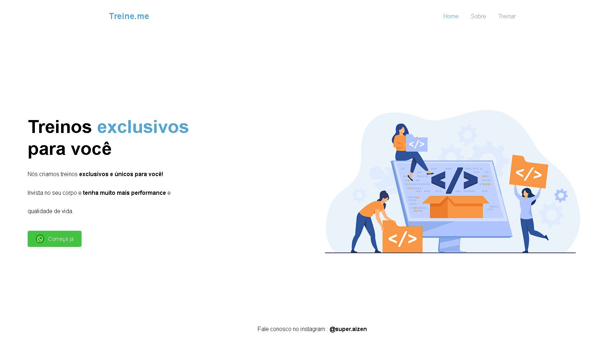

<h1 align="center"> Landing Page treine.me</h1>

Landing page para treinar responsividade   

  <a href="#-tecnologias">Tecnologias</a>&nbsp;&nbsp;&nbsp;|&nbsp;&nbsp;&nbsp;
  <a href="#-projeto">Projeto</a>&nbsp;&nbsp;&nbsp;|&nbsp;&nbsp;&nbsp;
  <a href="#-layout">Layout</a>&nbsp;&nbsp;&nbsp;|&nbsp;&nbsp;&nbsp;
  <a href="#memo-licença">Licença</a>

  

 

  

## 🚀 Tecnologias

Esse projeto foi desenvolvido com as seguintes tecnologias:

- HTML
- CSS

## 💻 Projeto

Projeto landing page para treinar responsividade 

- [Visite o projeto online](https://landing-page-treineme.netlify.app/)
## 🔖 Layout

## :memo: Licença

Esse projeto está sob a licença MIT.

---

Feito com ♥ by Filipe Aizen 